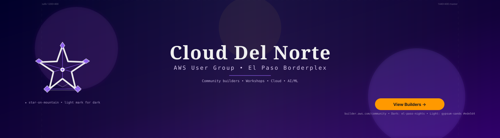
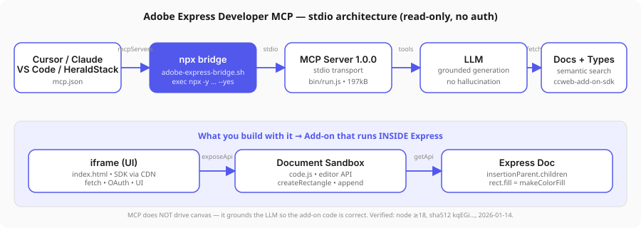
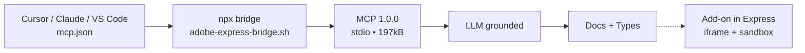
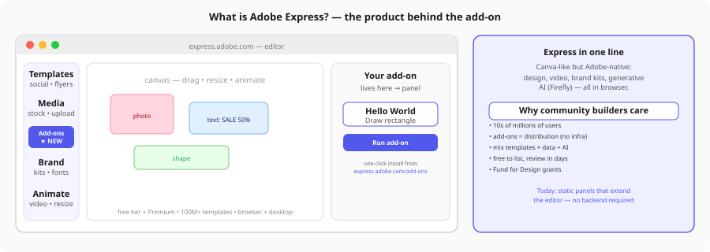
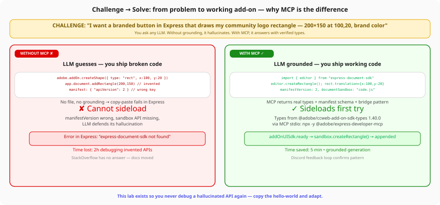
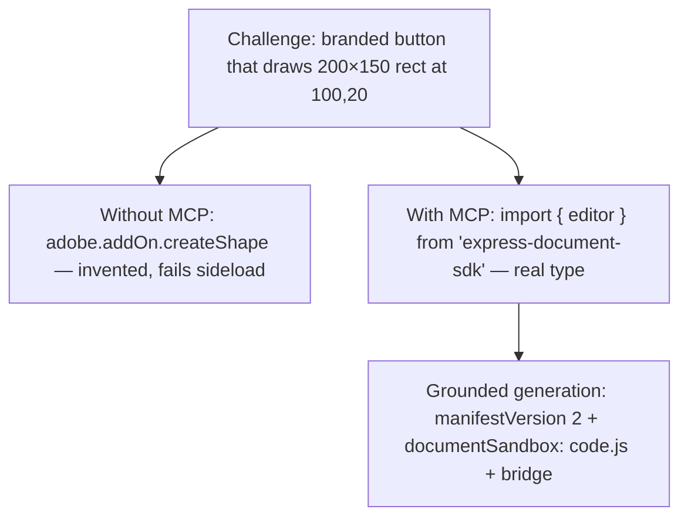
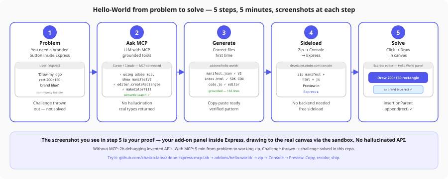
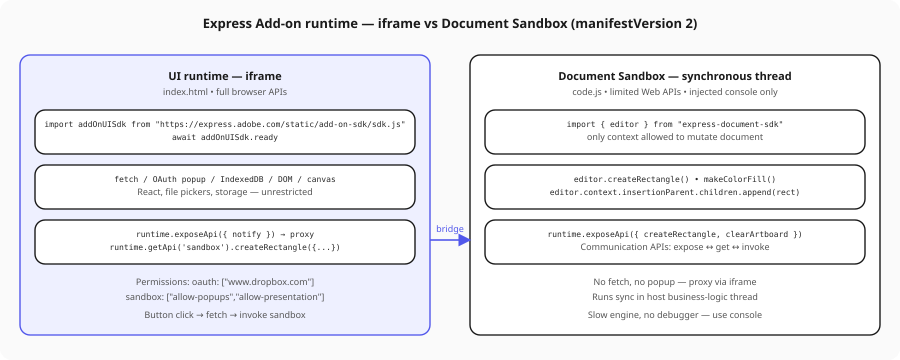
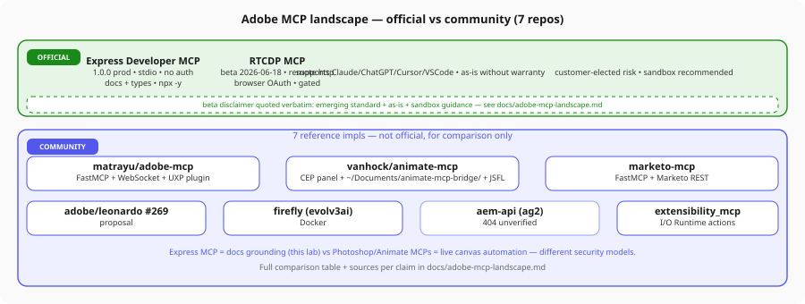

# adobe-express-mcp-lab

> lab for the adobe express developer mcp — first adobe mcp use case for chasko-labs. documents process, learnings, features, settings, versions, wiring per heraldstack-mcp standards. reproducible starter so any heraldstack agent can ground express add-on work without hallucination.



> **new use case — aws builder center banner:** community builder cover for `builder.aws.com/community/@alias` — generated from this lab's design-system tokens via the mcp. see [use case](docs/use-cases/aws-builder-center-banner.md) · [spec](spec/use-cases/aws-builder-center-banner-spec.md) · [plan](spec/use-cases/aws-builder-center-banner-plan.md) · [add-on](addons/aws-builder-banner/) · [raw svg](https://raw.githubusercontent.com/chasko-labs/adobe-express-mcp-lab/main/docs/assets/aws-builder-center-banner.svg)





## table of contents

1. [what this lab is](#what-this-lab-is)
2. [what is adobe express?](#what-is-adobe-express)
3. [what you can build as a community builder](#what-you-can-build-today-as-a-community-builder)
4. [what the mcp unlocks](#what-the-mcp-unlocks-and-why-without-it-you-fail)
5. [hello-world — challenge → solve (screenshots)](#hello-world--from-challenge-thrown-to-challenge-solved-with-screenshots)
6. [quick start — 30 seconds](#quick-start--30-seconds)
7. [guided tour — read in order](#guided-tour--read-in-order)
8. [visual map](#visual-map)
9. [version matrix](#version-matrix)
10. [settings matrix — where mcp.json lives](#settings-matrix--where-mcpjson-lives)
11. [hello-world — proof it works](#hello-world--proof-it-works)
12. [repo layout](#repo-layout)
13. [key people and sites](#key-people-and-sites)
14. [contributing and learnings](#contributing-and-learnings)

## what this lab is

- **not a fork of adobe docs** — curation + wiring + verification.
- **read-only, no auth, stdio** — package `@adobe/express-developer-mcp@1.0.0` exposes semantic search + typescript types so the llm stops inventing `adobe.addOn.createShape`.
- **heraldstack-aware** — bridge `mcp/adobe-express-bridge.sh` = `exec npx -y @adobe/express-developer-mcp@latest --yes`, registry entry `adobe-express-developer` (shannon + haunting, `status: active`, `env_required: []`).
- **deferred:** rtdcp cdp beta data plane (needs sandbox pii review), photoshop/animate/firefly mcps beyond landscape comparison. see [docs/dispatch-plan.md](docs/dispatch-plan.md).

## what is adobe express?



adobe express is adobe's browser-native design platform — think canva, but with adobe dna. it runs entirely in the browser (and desktop wrapper) at `express.adobe.com`. non-designers and pros ship social posts, flyers, presentations, videos, brand kits, and generative media in minutes.

- **canvas:** drag, resize, animate — photos, text, shapes, video. no photoshop learning curve.
- **templates + stock + firefly:** 100m+ templates, adobe stock, and firefly generative ai (text-to-image, generative fill) built in.
- **free + premium:** free tier covers most creation; premium unlocks brand kits, premium templates, and background removal.

as a developer, the key fact: express is extensible **only** via add-ons (this lab) — static panels that live inside the editor, not external automations. that is where community builders plug in.

## what you can build today as a community builder

you do not need a backend or devops. an add-on is `manifest.json + index.html + code.js` — a panel that users install in one click from `express.adobe.com/add-ons`. today (2026) the model supports:

| what                   | example community add-on                                                                                       |
| ---------------------- | -------------------------------------------------------------------------------------------------------------- |
| **brand tools**        | one-click brand palette → draws branded rectangles, text, logos via `editor.createRectangle` + `makeColorFill` |
| **data-driven design** | pull airtable/notion/google sheets → generate 10 flyers at once                                                |
| **ai workflows**       | call openai/claude/stability from the iframe (full fetch) → proxy result to sandbox → draw                     |
| **content packs**      | curated sticker/shape libraries, icon sets, localized templates                                                |
| **utility**            | bulk resize, QR code, background remover wrapper                                                               |

**distribution:** free to author and list. submit zip via https://developer.adobe.com/console → automated manifest checks + human review (days, not weeks) → live on the express marketplace, auto-updated to users. no server to run — your iframe is served from adobe's cdn. Fund for Design grants exist for standout ideas (see [docs/ecosystem.md](docs/ecosystem.md) pricing notes).

**limits today:** manifestVersion 2, single `panel` entry point, `requirements.apps: [{name: "Express", apiVersion: 1}]` (express-only, no photoshop/illustrator), no arbitrary filesystem, no native c++. see [docs/ecosystem.md#7](docs/ecosystem.md) for cep/uxp vs express trade-offs.

## what the mcp unlocks (and why without it you fail)





without the mcp, every llm hallucinates. ask `build me an express add-on` and you get:

- `adobe.addOn.createShape({type: "rect"})` — does not exist
- `app.document.addRectangle(200,150)` — invented, from photoshop
- `manifest: { "apiVersion": 2 }` — wrong key, sideload rejects

you lose 2 hours debugging an api that never existed, defending the llm's fiction.

with `@adobe/express-developer-mcp@1.0.0` (stdio, no auth, 197kB), the llm has tools for:

- **semantic search** over https://developer.adobe.com/express/add-ons/docs — finds the real snippet
- **typescript types** from `@adobe/ccweb-add-on-sdk-types@1.40.0` — `editor.createRectangle`, `editor.context.insertionParent`, `editor.makeColorFill`
- **manifest schema grounding** — `manifestVersion: 2`, `documentSandbox: "code.js"`, permissions `sandbox` + `oauth`

result: the code in [addons/hello-world/](addons/hello-world/) is correct first try. see the red vs green panel above — this lab exists so you never debug a hallucinated api again.

full truth in [docs/mcp-technical.md](docs/mcp-technical.md) (versions, sha512, transport).

## hello-world — from challenge thrown to challenge solved (with screenshots)



> **challenge thrown:** _"as a community builder, i need a button inside express that drops my branded 200×150 rectangle at 100,20 in one click — no user should pick color or size."_

> **challenge solved:** the 5 screenshots above are the proof. walk them:

**1. problem** — user request: branded rect, fixed size/position. not solved yet.

**2. ask mcp** — in cursor/claude with `adobe-express-developer` connected, prompt:

```text
using the adobe express mcp, show me manifestVersion 2 and the document sandbox
pattern to append a rectangle at 100,20. generate the 3 files.
```

mcp returns: `editor.createRectangle`, `makeColorFill`, `insertionParent.children.append`, plus `https://express.adobe.com/static/add-on-sdk/sdk.js` + `addOnUISdk.ready` + bridge `exposeApi/getApi`. no hallucination.

**3. generate** — llm writes [addons/hello-world/manifest.json](addons/hello-world/manifest.json), [index.html](addons/hello-world/index.html), [code.js](addons/hello-world/code.js) — 132 lines grounded. copy-paste ready. see the `editor` import in code.js — that is the real api (verify in [docs/ecosystem.md](docs/ecosystem.md) §4).

**4. sideload** — zip the three files → upload at https://developer.adobe.com/console → preview in express (no backend, free). takes 30 seconds.

**5. solve** — in express: open any document → add-ons panel → _hello world_ → click **draw 200×150 rectangle** → blue rect appears at `100,20` via `insertionParent.children.append(rect)`. screenshot 5 is that panel + canvas. click **clear** to wipe. challenge solved.

```bash
cd addons/hello-world && zip hello-world.zip manifest.json index.html code.js
# console → preview → express → add-ons → hello world → draw
```

**your turn:** fork this repo, recolor `fill: [0.32, 0.52, 0.92, 1]` to your brand, bump `version` in manifest.json, re-zip, resubmit. you now own distribution to millions from one static panel. the mcp made it 5 minutes instead of 2 hours.



details: [docs/ecosystem.md](docs/ecosystem.md) (iframe full browser apis vs sandbox synchronous thread), [spec/wiring.md](spec/wiring.md) (how the bridge is wired per heraldstack).

## quick start — 30 seconds

```bash
# 1. verify node
node --version  # >=18

# 2. try the mcp directly (stdio, no install)
npx -y @adobe/express-developer-mcp@latest --yes
# → Adobe Express Developer MCP Server 1.0.0 started, using STDIO transport

# 3. or via heraldstack bridge
bash ./mcp/adobe-express-bridge.sh

# 4. wire into your ide — pick one
# cursor: ~/.cursor/mcp.json
# claude desktop: ~/Library/Application Support/Claude/claude_desktop_config.json
# vscode: ~/.vscode/mcp.json
# heraldstack: configs/shannon.mcp.json / haunting.mcp.json
```

then restart ide → mcp panel shows `adobe-express-developer` connected → ask `using the adobe express mcp, show me manifestVersion 2 schema`.

feedback to adobe: discord https://discord.com/invite/nc3QDyFeb4

## guided tour — read in order

walk these six docs in order — each one assumes the prior. start here, not in a random doc.

### 1. dispatch plan — the roster and spec

**[docs/dispatch-plan.md](docs/dispatch-plan.md)** · alias [spec/plan.md](spec/plan.md) — canonical. 5 async agents, resources, deliverables, parallelization, success criteria. roster:

| #   | agent                   | delivers                                                                                      |
| --- | ----------------------- | --------------------------------------------------------------------------------------------- |
| 1   | express-mcp-technical   | [docs/mcp-technical.md](docs/mcp-technical.md)                                                |
| 2   | express-ecosystem       | [docs/ecosystem.md](docs/ecosystem.md)                                                        |
| 3   | adobe-mcp-landscape     | [docs/adobe-mcp-landscape.md](docs/adobe-mcp-landscape.md)                                    |
| 4   | heraldstack-standards   | [spec/wiring.md](spec/wiring.md) + bridge                                                     |
| 5   | repo-design + learnings | [docs/learnings.md](docs/learnings.md) + [docs/key-people-sites.md](docs/key-people-sites.md) |

read this first to understand _why_ the repo is shaped this way.

### 2. mcp-technical — package truth (no hallucination)

**[docs/mcp-technical.md](docs/mcp-technical.md)** — verified via `npm view --json` + adobe docs. answers:

- what version? `1.0.0` latest (created `2026-01-14T17:44:57Z`, modified `2026-07-08T08:12:01Z`, tarball `express-developer-mcp-1.0.0.tgz`, sha512 `kqEGiGSb...`, 14 files, 197kB, `bin: adobe-express-developer-mcp-server → bin/run.js`, `type: module`)
- what transport? `stdio` via `npx -y @adobe/express-developer-mcp@latest --yes` — no auth, no docker.
- what predecessor? `@adobe/express-add-on-dev-mcp` deprecated beta superseded.
- what capabilities? semantic search, typescript definitions (`@adobe/ccweb-add-on-sdk-types`), structured grounding.
- where does config live? cursor `~/.cursor/mcp.json`, claude `claude_desktop_config.json`, vscode `~/.vscode/mcp.json` — snippets in doc.


### 3. ecosystem — how express add-ons actually work

**[docs/ecosystem.md](docs/ecosystem.md)** — the mental model you need before writing code.

- **manifestVersion 2** — `manifest.json` at root, `requirements.apps: [{name: "Express", apiVersion: 1}]`, single `panel` entry point with `main: index.html` + `documentSandbox: code.js`, permissions `sandbox` + `oauth`.
- **two runtimes:** `iframe` (ui — `https://express.adobe.com/static/add-on-sdk/sdk.js`, `addOnUISdk.ready`, full browser apis, fetch, oauth popup) vs `document sandbox` (synchronous thread — `import { editor } from "express-document-sdk"`, `editor.createRectangle`, `makeColorFill`, `insertionParent.children.append`, limited web apis, slow engine, injected console only).
- **bridge:** communication apis `exposeApi` / `getApi` — iframe proxies, sandbox mutates.
- **distribution:** express marketplace `express.adobe.com/add-ons`, semver versioning, review.
- **cep/uxp vs express:** 9-row comparison — why express is iframe+sandbox (safe, fast review) vs cep's CEF+node and uxp's native plugins.


### 4. landscape — official vs community (know what not to mix)

**[docs/adobe-mcp-landscape.md](docs/adobe-mcp-landscape.md)** — comparison table for all adobe-related mcps.

- **official:** express developer mcp (production, stdio, Dev Console oauth) vs rtdcp mcp (beta `2026-06-18`, remote http, browser oauth, gated by adobe rep, 5 quoted warnings: as-is without warranty, emerging standard, customer-elected risk, sandbox recommended).
- **community 7:** `matrayu/adobe-mcp` (FastMCP+WebSocket+UXP), `vanhock/adobe-animate-mcp` (CEP + `~/Documents/animate-mcp-bridge/` + JSFL), `marketo-mcp` (FastMCP+Marketo REST), `adobe/leonardo#269` (proposal), `firefly` (evolv3ai Docker), `aem-api` (404 unverified), `extensibility_mcp` (I/O Runtime). columns: transport/auth/tools/stars/activity.

crucial distinction: express mcp = _docs grounding_ (this lab) vs photoshop/animate mcps = _live canvas automation_ — different security models.



### 5. wiring — how it plugs into heraldstack-mcp

**[spec/wiring.md](spec/wiring.md)** — the standard. registry entry:

```yaml
- name: adobe-express-developer
  description: "adobe express add-on docs + typescript definitions mcp"
  launcher: launchers/bridges/adobe-express-bridge.sh
  runtime: npx
  image: "@adobe/express-developer-mcp"
  baked: null
  session_wired: [shannon, haunting]
  env_required: []
  status: active
  transport: stdio
  notes: "read-only docs/types, stdio via npx, no auth, opt-in for addon work"
```

launcher `mcp/adobe-express-bridge.sh` is one line: `exec npx -y @adobe/express-developer-mcp@latest --yes`. config sync `mcp/mcp.json` gives four variants (cursor/claude/vscode/heraldstack uses `bash -c ./mcp-launchers/run.sh adobe-express-bridge.sh`). discipline: bare-name stdio only, no `type:http`, secrets via env/ssm, gateway deferred.


### 6. people, sites, and learnings

- **[docs/key-people-sites.md](docs/key-people-sites.md)** — who to ask, where to look: adobe express team https://developer.adobe.com/express/add-ons/docs/, discord https://discord.com/invite/nc3QDyFeb4, npm maintainers `marbec tripod garthdb patrickfulton trieloff shazron krisnye +20` (author Adobe Inc.), experience league rtdcp beta, github adobe + community repos.
- **[docs/learnings.md](docs/learnings.md)** — what broke: `workflow_capacity slot retry changed immutable authority` on journal replay after hash change → mitigation null-guard + fresh launch vs resume, plus mcp version pinning and discord latency.

## visual map

all four svgs live in [docs/assets/](docs/assets/) and are embedded at the top of their doc plus a mermaid duplicate for github dark-mode:

| doc                    | svg                                                            | what it shows                                     |
| ---------------------- | -------------------------------------------------------------- | ------------------------------------------------- |
| mcp-technical.md       | [mcp-architecture.svg](docs/assets/mcp-architecture.svg)       | stdio chain + what add-on runs inside express     |
| ecosystem.md           | [sandbox-iframe-flow.svg](docs/assets/sandbox-iframe-flow.svg) | iframe (fetch/oauth) vs sandbox (editor) + bridge |
| adobe-mcp-landscape.md | [landscape-map.svg](docs/assets/landscape-map.svg)             | official 2 vs community 7 map                     |
| spec/wiring.md         | [wiring-flow.svg](docs/assets/wiring-flow.svg)                 | registry → bridge → dispatcher → configs → IDE    |

raw urls for embeds: `https://raw.githubusercontent.com/chasko-labs/adobe-express-mcp-lab/main/docs/assets/<name>.svg`

## version matrix

| component                    | version      | notes                                                                      |
| ---------------------------- | ------------ | -------------------------------------------------------------------------- |
| @adobe/express-developer-mcp | 1.0.0 latest | supersedes @adobe/express-add-on-dev-mcp beta, sha512 kqEGi..., 2026-01-14 |
| node                         | >=18         | engines field, required for npx bridge                                     |
| express add-on manifest      | v2           | document sandbox + ui entrypoints                                          |
| rtdcp mcp                    | beta         | remote http, browser oauth, invite via adobe rep, as-is                    |

## settings matrix — where mcp.json lives

| ide            | file                         | snippet                                                                                                                          |
| -------------- | ---------------------------- | -------------------------------------------------------------------------------------------------------------------------------- |
| cursor         | `~/.cursor/mcp.json`         | `{ "mcpServers": { "adobe-express-developer": { "command": "npx", "args": ["@adobe/express-developer-mcp@latest","--yes"] } } }` |
| claude desktop | `claude_desktop_config.json` | same as cursor                                                                                                                   |
| vscode         | `~/.vscode/mcp.json`         | `{ "servers": { "adobe-express-developer": { "command": "npx", "args": ["@adobe/express-developer-mcp@latest","--yes"] } } }`    |
| heraldstack    | `configs/*.mcp.json`         | `{ "adobe-express-developer": { "command": "bash", "args": ["-c","./mcp-launchers/run.sh adobe-express-bridge.sh"] } }`          |

## hello-world — proof it works

**[addons/hello-world/](addons/hello-world/)** — minimal add-on grounded by the mcp types (so the llm did not invent `adobe.addOn.*`).

- [manifest.json](addons/hello-world/manifest.json) — `manifestVersion: 2` panel
- [index.html](addons/hello-world/index.html) — imports `https://express.adobe.com/static/add-on-sdk/sdk.js`, waits `addOnUISdk.ready`, button calls `sandbox.createRectangle`
- [code.js](addons/hello-world/code.js) — `import { editor } from "express-document-sdk"` then `editor.createRectangle()` + `makeColorFill` + `append`

```bash
cd addons/hello-world && zip hello-world.zip manifest.json index.html code.js
# upload zip via https://developer.adobe.com/console → preview in express
```

click `draw 200×150 rectangle` → blue rectangle at `100,20` via `insertionParent.children.append`.

## repo layout

```
/README.md                      ← you are here — toc + guided tour
/docs/dispatch-plan.md          ← canonical roster (5 agents)
/docs/mcp-technical.md          ← package truth + svg + mermaid
/docs/ecosystem.md              ← iframe vs sandbox + svg + mermaid
/docs/adobe-mcp-landscape.md    ← official vs community + svg + mermaid
/docs/key-people-sites.md       ← who/where table
/docs/learnings.md              ← workflow_capacity + pinning notes
/docs/assets/*.svg              ← 4 architecture diagrams
/spec/plan.md                   ← alias to dispatch plan
/spec/wiring.md                 ← heraldstack registry + svg + mermaid
/mcp/adobe-express-bridge.sh    ← exec npx -y @adobe/express-developer-mcp@latest --yes
/mcp/mcp.json                   ← 4 ide variants
/addons/hello-world/            ← grounded sample (manifest + html + js)
```

## key people and sites

| who/what           | where                                                                                                    | role                                     |
| ------------------ | -------------------------------------------------------------------------------------------------------- | ---------------------------------------- |
| adobe express team | https://developer.adobe.com/express/add-ons/docs/                                                        | docs, sdk, samples                       |
| discord            | https://discord.com/invite/nc3QDyFeb4                                                                    | feedback to adobe for mcp server         |
| npm maintainers    | https://www.npmjs.com/package/@adobe/express-developer-mcp                                               | marbec, tripod, garthdb +20 (Adobe Inc.) |
| experience league  | https://experienceleague.adobe.com/en/docs/experience-platform/rtcdp/intro/rtcdp-mcp                     | rtdcp beta docs                          |
| community          | matrayu/adobe-mcp, vanhock/adobe-animate-mcp, marketo-mcp, leonardo#269, firefly, aem, extensibility_mcp | reference impls for landscape            |

full table in [docs/key-people-sites.md](docs/key-people-sites.md).

## contributing and learnings

- [CONTRIBUTING.md](CONTRIBUTING.md) — branch protection (`main` protected, pr review, linear history), style guide (lowercase plain ascii), source citations required.
- [docs/learnings.md](docs/learnings.md) — workflow capacity failure `slot retry changed immutable authority` → null-guard + fresh launch, version pinning to `1.0.0` sha512, discord latency.
- license MIT — [LICENSE](LICENSE)
- `.gitignore` covers `node_modules/ dist/ .env .env.* .DS_Store *.log .ccx coverage/`

---

quick links: [adobe mcp docs](https://developer.adobe.com/express/add-ons/docs/guides/getting-started/local-development/mcp-server) · [npm](https://www.npmjs.com/package/@adobe/express-developer-mcp) · [rtdcp beta](https://experienceleague.adobe.com/en/docs/experience-platform/rtcdp/intro/rtcdp-mcp) · [express marketplace](https://express.adobe.com/add-ons)
