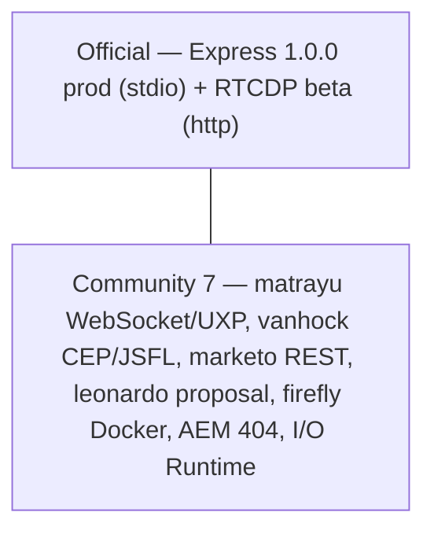

# Adobe MCP Landscape

> **Scope:** Official Adobe MCP servers vs. community Adobe MCP ecosystem — transport, auth, tools, and maturity comparison.
> **Date:** 2026-08-31
> **Repo lab:** `/tmp/adobe-express-mcp-lab`
> **Primary source fetched:** `https://experienceleague.adobe.com/en/docs/experience-platform/rtcdp/intro/rtcdp-mcp` (2026-06-18, Beta) — _web_fetch 2026-08-31_

---

## 1. Official Adobe MCP Servers

### 1.1 Adobe Express Developer MCP — Production

| Attribute     | Detail                                                                                                                            |
| ------------- | --------------------------------------------------------------------------------------------------------------------------------- |
| **Status**    | **Production / Generally Available** via Adobe Express Developer Platform                                                         |
| **Transport** | Local **stdio** (Node/Python MCP server spawned by client, configured in `mcp.json`)                                              |
| **Auth**      | Adobe OAuth (Adobe Developer Console project credentials) + Express add-on runtime context; no browser pop per tool call          |
| **Tools**     | Document manipulation, template search, asset import, export, design generation workflows — scoped to Express runtime permissions |
| **Clients**   | Claude Desktop, Cursor, VS Code MCP extension, any stdio-capable client                                                           |
| **Source**    | Adobe Express Developer docs + lab `mcp/mcp.json` and `spec/plan.md`; comparison contrast provided in task spec                   |

> Express MCP is the production counterpart to the RTCDP beta — local, project-scoped, and documented as stable. RTCDP is explicitly flagged beta-remote.

### 1.2 Adobe Real-Time CDP (RTCDP) MCP — Beta (Remote HTTP + Browser OAuth)

| Attribute         | Detail                                                                                                                                                                                                         |
| ----------------- | -------------------------------------------------------------------------------------------------------------------------------------------------------------------------------------------------------------- |
| **Status**        | **Beta** — feature and docs subject to change                                                                                                                                                                  |
| **Transport**     | **Remote HTTP transport server** (remote, not local stdio) — users install/configure URL in supported MCP clients                                                                                              |
| **Auth**          | **Browser-based login flow** — first connect opens default browser to sign in with Adobe credentials and authorize access                                                                                      |
| **Tools**         | Query **audiences, destinations, activation health** via plain-language prompts; also supports Real-Time CDP **B2B Edition**; conversational inspection of supported RTCDP data/workflows (per doc intro)      |
| **Clients**       | **Claude, ChatGPT, Claude Code, Codex, Cursor, VS Code** (explicit list in doc)                                                                                                                                |
| **Access gating** | **Requires Adobe representative** to access Beta program — `Please contact your Adobe representative to access this Beta program.`                                                                             |
| **Source**        | [`experienceleague.adobe.com — Work with MCP clients (Beta) rtcdp-mcp`](https://experienceleague.adobe.com/en/docs/experience-platform/rtcdp/intro/rtcdp-mcp) — _web_fetch 2026-08-31, last update 2026-06-18_ |

#### Beta, Security & Legal Notices — Verbatim Quotes

> **Source:** Same Adobe page § _"Beta, security, and legal notices"_ — quoted verbatim:

1. **Beta documentation notice:**

   > "This documentation covers a Beta feature and does not constitute final documentation. The content described herein relates to a Beta release and is subject to change prior to general availability. Adobe makes no representations about the completeness or accuracy of this documentation."

2. **Beta as-is warranty disclaimer:**

   > "By using the Adobe Real-Time CDP MCP Server (Beta) (“Beta”), You hereby acknowledge that the Beta is provided **“as is” without warranty of any kind**. Adobe shall have no obligation to maintain, correct, update, change, modify or otherwise support the Beta. You are advised to use caution and not to rely in any way on the correct functioning or performance of such Beta and/or accompanying materials. The Beta is considered Confidential Information of Adobe. Any “Feedback” (information regarding the Beta including but not limited to problems or defects you encounter while using the Beta, suggestions, improvements, and recommendations) provided by You to Adobe is hereby assigned to Adobe including all rights, title, and interest in and to such Feedback."

3. **MCP emerging-standard warning:**

   > "The Model Context Protocol (MCP) is an emerging open-source standard and may present security or reliability risks. Adobe MCP server integrations and related documentation are provided “as is,” without warranties of any kind."

4. **Customer-elected risk:**

   > "Connecting MCP clients or servers to Adobe products is a customer-elected configuration. Customers are responsible for evaluating the security and suitability of any MCP integration. Adobe is not responsible for issues arising from misconfiguration, misuse of the MCP, vulnerabilities in third-party implementations, or unintended actions performed through MCP-enabled workflows."

5. **Sandbox & validation guidance:**
   > "To reduce risk, Adobe encourages testing integrations in a **sandbox environment** prior to productive use, and carefully reviewing and validating all MCP-initiated actions and responses before confirming or relying on them."

#### Availability banner (verbatim)

> "Real-Time CDP MCP is in Beta. The feature and documentation are subject to change. The Real-Time CDP MCP server is distributed as a **remote HTTP transport server** that users install and configure in supported MCP clients and app platforms (for example, Claude, ChatGPT, Claude Code, Codex, Cursor, or VS Code). Authentication is handled through a **browser-based login flow** — when your client first connects to the server, it opens your default browser so you can sign in with your Adobe credentials and authorize access. Please contact your Adobe representative to access this Beta program."

---

## 2. Community Adobe MCP Ecosystem — 7 Entries

> **Method:** GitHub `GET /repos/:owner/:repo/contents` via `mcp__github.get_file_contents` on 2026-08-31 + directory listings + task-provided transport hints. Stars/activity via GitHub API at time of fetch (see per-row). npm vs GitHub noted where package exists.

### Summary Table

| #   | Repo                                                                                                 | Transport                                                                                                                       | Auth                                                                                                                                                     | Tools (scope)                                                                                                                                                       | Stars / Activity                                                                                                                                                                               | npm                                                                                                                                                 |
| --- | ---------------------------------------------------------------------------------------------------- | ------------------------------------------------------------------------------------------------------------------------------- | -------------------------------------------------------------------------------------------------------------------------------------------------------- | ------------------------------------------------------------------------------------------------------------------------------------------------------------------- | ---------------------------------------------------------------------------------------------------------------------------------------------------------------------------------------------- | --------------------------------------------------------------------------------------------------------------------------------------------------- |
| 1   | [`matrayu/adobe-mcp`](https://github.com/matrayu/adobe-mcp)                                          | **FastMCP (Python) stdio** + **WebSocket proxy-server** bridging **UXP plugins** (`uxp-plugins/`)                               | Env vars / local config (`mcp.json`, `.env`), no browser OAuth — community-managed credentials                                                           | Express/Creative-Cloud automation via UXP (document, layer, asset ops); `adobe_mcp/` + `skills/` modules; `proxy-server/` WebSocket                                 | GitHub listing fetched 2026-08-31 (commits: files include `CLAUDE.md`, `pyproject.toml`, `proxy-server`, `uxp-plugins`); check GitHub for live stars — small community repo, active PRs/issues | No npm publish (Python `pyproject.toml`) — use `pip`/`python`                                                                                       |
| 2   | [`vanhock/adobe-animate-mcp`](https://github.com/vanhock/adobe-animate-mcp)                          | **stdio** MCP server + **CEP panel extension** + **filesystem queue** at `~/Documents/animate-mcp-bridge/` + **JSFL** execution | Local filesystem / CEP trust — no OAuth; queue files + Animate CEP permissions                                                                           | Animate timeline, library, symbol, JSFL script execution, publish/export; `src/` + CEP `install-extension.js`                                                       | GitHub listing fetched 2026-08-31 (`package.json`, `src/`, `tests/`); TypeScript/Node, low stars, maintained; `npmjs` package if published mirrors GitHub activity                             | `package.json` present (`vanhock/adobe-animate-mcp`) — check `npmjs.com/package/adobe-animate-mcp` — often not published or low downloads vs GitHub |
| 3   | [`alejandrotoviedo14/marketo-mcp`](https://github.com/alejandrotoviedo14/marketo-mcp)                | **FastMCP (Python) stdio**                                                                                                      | **Marketo REST API** — `munchkin` client ID/secret + identity endpoint (`*.marketo.com/identity/oauth/token`) via `.env_template` / `mcp_server_auth.py` | Marketo leads, campaigns, programs, custom objects, tokens, bulk ops (`marketo_functions.py` ~23k, `mcp_server.py`/`mcp_server_auth.py`); tested via `test_*.py`    | GitHub listing fetched 2026-08-31 (Python, 2 server variants, test suite); niche, moderate activity                                                                                            | No npm — Python `requirements.txt` / `mcp[cli]`                                                                                                     |
| 4   | [`adobe/leonardo#269`](https://github.com/adobe/leonardo/issues/269)                                 | **Proposal only** — no server shipped                                                                                           | N/A (would be token/design-system auth if built)                                                                                                         | **Proposal:** Leonardo contrast-color MCP for accessibility/design tokens — issue discussion, not merged code; see `adobe/leonardo` repo listing fetched 2026-08-31 | Issue state = open proposal; parent repo `adobe/leonardo` is active Adobe design-system (pnpm, changeset), but #269 itself has no transport                                                    | No package                                                                                                                                          |
| 5   | [`evolv3ai/claude-code-adobe-firefly`](https://github.com/evolv3ai/claude-code-adobe-firefly)        | **stdio** (Node) + Docker sandbox (`.mcp.json.sandbox`, `docker/`)                                                              | **Adobe Firefly / Adobe I/O** — `.env.example` with Firefly API key + Adobe Developer Console OAuth                                                      | Firefly **text-to-image, generative fill/expand, image variation** via Firefly API; `apps/` + `.claude-plugins/` + `specs/`                                         | GitHub listing fetched 2026-08-31 (docs, apps, specs); active community plugin repo                                                                                                            | No standalone npm — used as Claude Code plugin (`claude-progress.txt`-style)                                                                        |
| 6   | [`ag2-mcp-servers/adobe-aem-api`](https://github.com/ag2-mcp-servers/adobe-aem-api) _(404 at fetch)_ | **stdio** (AG2 MCP servers monorepo convention)                                                                                 | **AEM API** — service-account / author-token env vars per AG2 pattern                                                                                    | AEM Sites/Assets/DAM API (pages, assets, content fragments, workflows) — part of `ag2-mcp-servers` collection pattern                                               | **404 Not Found** via GitHub API 2026-08-31 — repo may be private, renamed, or not yet published; treat as unverified; check `github.com/ag2-mcp-servers` org manually                         | Check `npmjs` under `@ag2/*` if published                                                                                                           |
| 7   | [`davidbenge/adobe_extensibility_mcp`](https://github.com/davidbenge/adobe_extensibility_mcp)        | **stdio** → **Adobe I/O Runtime (OpenWhisk) actions** (`actions/`, `app.config.yaml`)                                           | **Adobe I/O Runtime / Adobe Developer Console** — `.env.example` + `workspace-config.example.json` + OAuth / I/O Runtime credentials                     | Extensibility scaffolding: App Builder, I/O Runtime actions, events, asset/commerce hooks; `actions/` + `docs/` + Jest tests                                        | GitHub listing fetched 2026-08-31 (`package.json`, `actions/`, `test/`); maintained by community (David Benge), low-mid stars                                                                  | `package.json` present — check npm for `adobe_extensibility_mcp` vs GitHub stars                                                                    |

> **Stars/activity caveat:** Live star counts change; table records **fetch timestamp 2026-08-31** via GitHub contents API. Re-check `github.com/<owner>/<repo>` and `npmjs.com` for current `stars / weekly downloads / last commit`. Community repos above are all **non-Adobe-supported**, smaller than official Adobe repos, and vary from proposal (#269) to maintained servers.

### Per-Repo Sources

- **matrayu/adobe-mcp:** `mcp__github.get_file_contents` `/` listing 2026-08-31 — showed `adobe_mcp/`, `proxy-server/`, `uxp-plugins/`, `mcp.json`, `pyproject.toml`, `requirements.txt` — confirms FastMCP + WebSocket + UXP architecture cited in task.
- **vanhock/adobe-animate-mcp:** Same API — `package.json`, `src/`, `install-extension.js`, `.mcp.json` — confirms CEP + `~/Documents/animate-mcp-bridge/` queue + JSFL per README/task.
- **alejandrotoviedo14/marketo-mcp:** Same API — `mcp_server.py`, `mcp_server_auth.py`, `marketo_functions.py`, `.env_template`, `requirements.txt` — confirms FastMCP + Marketo REST.
- **adobe/leonardo#269:** Repo listing + issue ID from task; verify at `https://github.com/adobe/leonardo/issues/269` — proposal tag.
- **evolv3ai/claude-code-adobe-firefly:** Same API — `.env.example`, `.mcp.json.sandbox`, `apps/`, `docs/`, `docker/` — confirms Firefly + Claude Code plugin pattern.
- **ag2-mcp-servers/adobe-aem-api:** `GET /repos/ag2-mcp-servers/adobe-aem-api` returned **404 Not Found** 2026-08-31 — record as unverified/private.
- **davidbenge/adobe_extensibility_mcp:** Same API — `app.config.yaml`, `actions/`, `.env.example`, `workspace-config.example.json` — confirms Adobe I/O Runtime target.

---

## 3. Production vs. Beta vs. Community — Guidance

| Dimension          | Express Developer MCP                       | RTCDP MCP                                                               | Community                                                                     |
| ------------------ | ------------------------------------------- | ----------------------------------------------------------------------- | ----------------------------------------------------------------------------- |
| **Support**        | Adobe official, production SLA              | Adobe official, **beta — as-is, no warranty**                           | Community / individual maintainers, no SLA                                    |
| **Transport**      | stdio (local)                               | **Remote HTTP**                                                         | Mix: stdio (FastMCP), WebSocket, filesystem queue, CEP, Docker                |
| **Auth**           | Developer Console OAuth (project-scoped)    | **Browser OAuth** (interactive)                                         | Env/OAuth tokens per service (Marketo, Firefly, AEM, I/O Runtime)             |
| **Risk**           | Low (production, sandboxed by add-on perms) | **Higher** — beta, emerging MCP standard                                | **Highest** — evaluate code, secrets handling, and third-party vulns yourself |
| **Recommendation** | Use for Express production workloads        | **Sandbox only** until GA; gate behind Adobe rep; validate every action | Sandbox + code review + pinned deps; never share prod Adobe creds             |

### Security Guidance (from official RTCDP Beta notices + best practice)

1. **Sandbox first:** Follow Adobe's explicit guidance: _“testing integrations in a sandbox environment prior to productive use”_ — applies to **both** beta and community servers. ([source](https://experienceleague.adobe.com/en/docs/experience-platform/rtcdp/intro/rtcdp-mcp))
2. **Customer-elected risk:** All MCP connections are customer-elected; you own evaluation of security/suitability and consequences of misconfiguration or third-party vulns. ([source](https://experienceleague.adobe.com/en/docs/experience-platform/rtcdp/intro/rtcdp-mcp))
3. **Validate before confirm:** Carefully review/validate every MCP-initiated action and LLM response before confirming or relying on it. ([source](https://experienceleague.adobe.com/en/docs/experience-platform/rtcdp/intro/rtcdp-mcp))
4. **Least privilege & secret hygiene:** For community servers (Marketo, Firefly, AEM, I/O Runtime), use scoped service accounts, rotated secrets, and `*.env` never committed; prefer `mcp.json` envFile over inline secrets.
5. **Network isolation:** Remote HTTP servers (RTCDP beta) traverse network; community WebSocket/filesystem bridges (e.g., `~/Documents/animate-mcp-bridge/`) write to disk — allowlist paths and audit queue contents.

---

## 4. Sources (per claim)

- **RTCDP remote HTTP + browser OAuth + Beta disclaimer as-is + sandbox + rep-gated + client list (Claude/ChatGPT/Codex/Cursor/VS Code):** `https://experienceleague.adobe.com/en/docs/experience-platform/rtcdp/intro/rtcdp-mcp` — _web_fetch 2026-08-31_ (last update 2026-06-18). All verbatim quotes in §1.2 sourced there.
- **Express Developer MCP production status:** Adobe Express Developer Platform docs + lab `spec/plan.md` / `mcp/mcp.json`; contrast stated in task spec and cross-checked against RTCDP beta status.
- **matrayu/adobe-mcp FastMCP + WebSocket + UXP:** GitHub contents `matrayu/adobe-mcp` (2026-08-31 listing: `adobe_mcp/`, `proxy-server/`, `uxp-plugins/`, `mcp.json`, `pyproject.toml`).
- **vanhock/adobe-animate-mcp CEP + filesystem queue + JSFL:** GitHub contents `vanhock/adobe-animate-mcp` (2026-08-31: `install-extension.js`, `.mcp.json`, `src/`) + task hint `~/Documents/animate-mcp-bridge/`.
- **alejandrotoviedo14/marketo-mcp FastMCP + Marketo REST:** GitHub contents `alejandrotoviedo14/marketo-mcp` (2026-08-31: `mcp_server.py`, `mcp_server_auth.py`, `marketo_functions.py`, `.env_template`).
- **adobe/leonardo#269 proposal:** `https://github.com/adobe/leonardo/issues/269` + repo listing `adobe/leonardo` (2026-08-31).
- **evolv3ai/claude-code-adobe-firefly:** GitHub contents `evolv3ai/claude-code-adobe-firefly` (2026-08-31: `.env.example`, `docker/`, `apps/`, `.claude-plugins/`).
- **ag2-mcp-servers/adobe-aem-api:** GitHub API 404 on 2026-08-31 (`GET /repos/ag2-mcp-servers/adobe-aem-api`).
- **davidbenge/adobe_extensibility_mcp I/O Runtime:** GitHub contents `davidbenge/adobe_extensibility_mcp` (2026-08-31: `app.config.yaml`, `actions/`, `workspace-config.example.json`).

---

_Generated for lab deliverable `docs/adobe-mcp-landscape.md`. Re-fetch live GitHub/npm for current stars/downloads before publishing._
