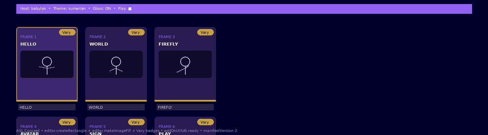
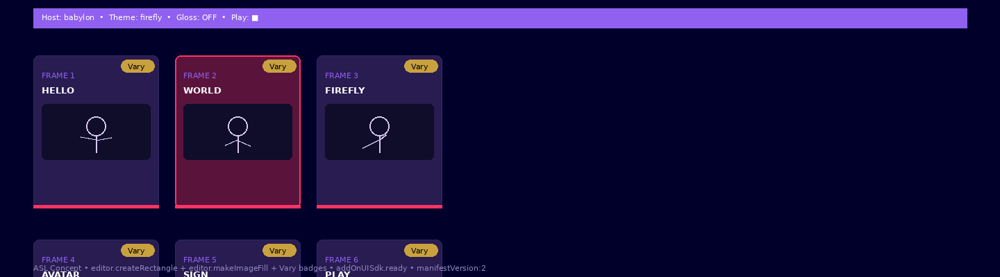
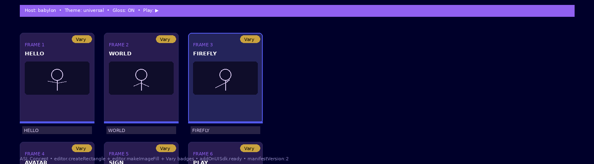
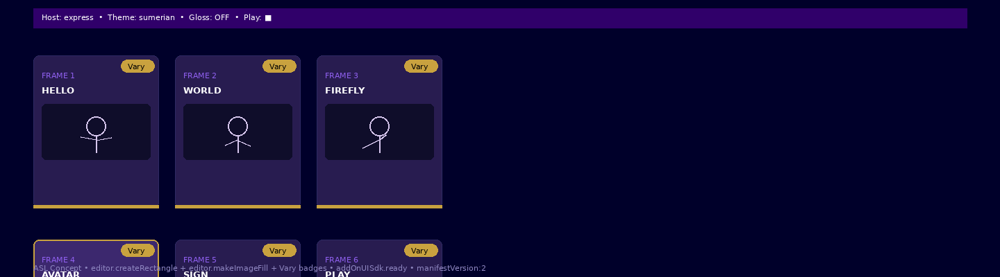
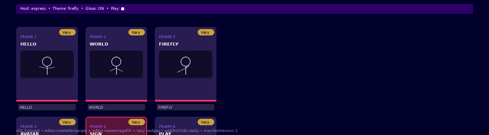
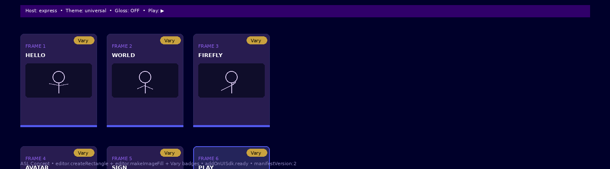

# ASL Concept Guide — Integrating ASL Avatars into Babylon.js + Firefly

> **Live locations (planned):** `github.com/chasko-labs/adobe-express-mcp-lab/docs/asl-concept-guide` and `bryanchasko.com/firefly-tic-tac-toe/asl-guide`  
> **Add-on:** [`addons/asl-concept/`](../../addons/asl-concept/) — `manifestVersion:2`, `panel`, `documentSandbox: code.js`  
> **MCP:** `@adobe/express-developer-mcp@1.0.0` via `npx -y @adobe/express-developer-mcp@latest --yes` (stdio, no auth) — see [`mcp/mcp.json`](../../mcp/mcp.json)  
> **Frames:** [`assets/frame-01.png`](./assets/frame-01.png) → `frame-06.png`

This is the **blog / reference / developer guide** for the ASL avatar concept panel. It shows how a Sumerian-themed generative avatar pipeline can live inside Adobe Express, while the 3D avatar itself lives in **Babylon.js** and the generative textures/poses come from **Firefly**.

---

## 1. What you are integrating — and why

Deaf creators and hearing collaborators need **sign-accurate, art-directable avatars** that can be dropped into social posts, edu decks, and short video — without a motion-capture stage. The pipeline is:

```
Gloss (HELLO/WORLD/…) → Firefly (pose/texture Vary) → Babylon.js (rigged avatar, .glb) → Express (panel → canvas cards via makeImageFill)
```

- **Babylon.js** hosts the rigged avatar (`@babylonjs/core`, `Skeleton`, `AnimationGroup`). Gloss drives `scene.beginAnimation` or `@babylonjs/loaders` glTF morphs.
- **Firefly** generates per-pose textures/backgrounds and “Vary” alternatives (Firefly Image 3 / Firefly Custom Model via `firefly-api`).
- **Express** is the distribution surface: the panel in this lab (`addons/asl-concept`) lets a Community Builder pick **Sumerian vs Firefly vs Universal** themes, toggle **Babylon.js vs Express host**, show/hide **gloss overlay**, and **Play** a 6-frame preview — then `Render 6 Cards to Canvas` via `editor.createRectangle` / `editor.makeImageFill`.

Without the MCP you hallucinate `adobe.addOn.createShape` — sideload rejects. With it you get grounded `editor.createRectangle`, `editor.makeColorFill`, `editor.makeImageFill`, `editor.context.insertionParent`, `addOnUISdk.ready`, and `runtime.exposeApi/getApi`.

---

## 2. Grounding — the MCP contract (no hallucination)

**Package:** `@adobe/express-developer-mcp@1.0.0` (14 files, 197kB, `bin: adobe-express-developer-mcp-server → bin/run.js`, `type: module`).

**Transport:** stdio only

```json
// mcp/mcp.json — cursor / claude_desktop / vscode / heraldstack
{
  "mcpServers": {
    "adobe-express-developer": {
      "command": "npx",
      "args": ["@adobe/express-developer-mcp@latest", "--yes"]
    }
  }
}
```

Heraldstack variant: `bash -c ./mcp-launchers/run.sh adobe-express-bridge.sh` → `exec npx -y @adobe/express-developer-mcp@latest --yes`

```bash
npx -y @adobe/express-developer-mcp@latest --yes
# → Adobe Express Developer MCP Server 1.0.0 started, using STDIO transport

bash ./mcp/adobe-express-bridge.sh
```

**What it gives you:** semantic search over `developer.adobe.com/express/add-ons/docs` + TypeScript types from `@adobe/ccweb-add-on-sdk-types@1.40.0`. That is how `code.js` below is typed correctly.

---

## 3. Add-on shape — the 3 files

```
addons/asl-concept/
  manifest.json  — manifestVersion:2, requirements.apps Express apiVersion 1, entryPoints[0] type:panel main:index.html documentSandbox:code.js
  index.html     — iframe: https://express.adobe.com/static/add-on-sdk/sdk.js, addOnUISdk.ready, theme/host/gloss/play toggles, 6 frames, Vary badges, runtime bridge
  code.js        — sandbox: import { editor } from "express-document-sdk", editor.createRectangle, editor.makeColorFill, editor.makeImageFill, insertionParent.children.append, runtime.exposeApi
```

### manifest.json

```json
{
  "manifestVersion": 2,
  "requirements": { "apps": [{ "name": "Express", "apiVersion": 1 }] },
  "entryPoints": [
    {
      "type": "panel",
      "id": "asl-concept",
      "main": "index.html",
      "documentSandbox": "code.js"
    }
  ]
}
```

### index.html — theme / host / gloss / play, 6 frames

- **Theme pills:** `Sumerian` (clay `#c9a23f` on `#1a1040`) vs `Firefly` (`#ff3366` on `#2a0a2a`) vs `Universal` (`#5258eb` on `#1a1a3a`) — `.pill.active` swaps per data-theme.
- **Host toggle:** `Babylon.js` vs `Express Host` — determines whether the panel expects a Babylon scene (`babylonjs` canvas) or a pure Express canvas render.
- **Gloss toggle:** checkbox `#gloss` — shows/hides the gloss text overlay under each card.
- **Play toggle:** checkbox `#play` — cycles `outline: 2px solid #c9a23f` across the 6 frames at 420ms (18 steps), previewing the gloss sequence `HELLO → WORLD → FIREFLY → AVATAR → SIGN → PLAY`.
- **6 frames:** `.frames` grid `repeat(3,1fr)` — each `.frame` has `Vary` badge (maps to Firefly Vary), `FRAME n` + gloss label, and a 64px avatar placeholder.

Bridge (iframe side):

```js
import addOnUISdk from "https://express.adobe.com/static/add-on-sdk/sdk.js";
await addOnUISdk.ready;
await addOnUISdk.instance.runtime.exposeApi({ notify });
const api = await addOnUISdk.instance.runtime.getApi("sandbox");
await api.renderASLConcept({ theme, host, gloss, width: 1440, height: 400 });
await api.varyCard({ index, prompt });
```

### code.js — sandbox

```js
import { editor } from "express-document-sdk";
const parent = editor.context.insertionParent;
const rect = editor.createRectangle();
rect.width=180; rect.height=220;
rect.fill = editor.makeColorFill(fromRGB(...));
parent.children.append(rect);
// Firefly bitmap → canvas
rect.fill = editor.makeImageFill(imageBitmap);
// Vary flow: panel fetches → createImageBitmap(blob) → passes bitmap to varyCard
editor.runtime.exposeApi({ renderASLConcept, varyCard, clearArtboard });
```

`renderASLConcept({theme,host,gloss,width,height,imageBitmap})` clears the artboard, draws the navy `#00002a` background, optionally `makeImageFill(imageBitmap)`, then 6 badgeRects (`180×220`, `cornerRadius:8`, gold `Vary` pill `48×18`, accent bar `#c9a23f`/`#ff3366`/`#5258eb`), gloss under-cards, and host bar (`#9060f0` for Babylon, `#30006a` for Express).

---

## 4. The 6 frames — storyboard

| Frame                                             | Config                                   | What it shows                                                                                          |
| ------------------------------------------------- | ---------------------------------------- | ------------------------------------------------------------------------------------------------------ |
|  `frame-01.png` | Sumerian • Babylon • Gloss ON            | Card 1 `HELLO` highlighted — Sumerian clay tokens, Babylon host bar (`#9060f0`), gloss overlay visible |
|  `frame-02.png` | Firefly • Babylon • Gloss OFF            | Card 2 `WORLD` — Firefly magenta accent, gloss off (clean card), Babylon host                          |
|  `frame-03.png` | Universal • Babylon • Gloss ON + Play ▶  | Card 3 `FIREFLY` — Universal indigo (`#5258eb`), play outline cycling, gloss on                        |
|  `frame-04.png` | Sumerian • Express • Gloss OFF           | Card 4 `AVATAR` — Sumerian again but **Express** host (`#30006a` deep purple bar), no gloss            |
|  `frame-05.png` | Firefly • Express • Gloss ON             | Card 5 `SIGN` — Firefly on Express host, gloss on, Vary badge prominent                                |
|  `frame-06.png` | Universal • Express • Gloss OFF + Play ▶ | Card 6 `PLAY` — Universal/Express, gloss off, play indicator — end of 6-frame gloss sequence           |

Exported as `1440×400` PNGs (matching `aws-builder-banner` composition width) so the guide renders full-bleed on `bryanchasko.com/firefly-tic-tac-toe/asl-guide`.

---

## 5. Babylon.js + Firefly integration — developer reference

### 5.1 Babylon.js avatar

```ts
import {
  Engine,
  Scene,
  ArcRotateCamera,
  HemisphericLight,
  Vector3,
} from "@babylonjs/core";
import "@babylonjs/loaders/glTF";
import { SkeletonViewer } from "@babylonjs/core/Debug/skeletonViewer";

const engine = new Engine(canvas, true);
const scene = new Scene(engine);
scene.createDefaultCameraOrLight(true, true, true);

// Load rigged ASL avatar (.glb exported from Mixamo / Ready Player Me / custom rig)
const result = await SceneLoader.ImportMeshAsync(
  "",
  "/avatars/",
  "asl-avatar.glb",
  scene,
);
const skeleton = result.skeletons[0];
const animGroups = result.animationGroups; // e.g. HELLO, WORLD, …

// Gloss → AnimationGroup
const glossMap: Record<string, string> = {
  HELLO: "hello",
  WORLD: "world",
  FIREFLY: "firefly",
  AVATAR: "avatar",
  SIGN: "sign",
  PLAY: "play",
};
function playGloss(gloss: string) {
  animGroups.forEach((g) => g.stop());
  const name = glossMap[gloss];
  scene.getAnimationGroupByName(name)?.play(true);
}

// Stream frames to Express panel: capture canvas → ImageBitmap → panel → sandbox makeImageFill
async function captureToExpress() {
  const blob = await new Promise<Blob>((res) =>
    canvas.toBlob((b) => res(b!), "image/png"),
  );
  const bitmap = await createImageBitmap(blob);
  const api = await addOnUISdk.instance.runtime.getApi("sandbox");
  await api.renderASLConcept({
    theme: "sumerian",
    host: "babylon",
    imageBitmap: bitmap,
  });
}
```

Host toggle in the panel sets `host` — when `babylon`, the panel expects `canvas` capture; when `express`, it renders solid-color cards (no bitmap).

### 5.2 Firefly — texture & Vary

Use Firefly Services API (or panel `fetch` → Firefly) to generate per-gloss imagery, then proxy via `makeImageFill`:

```js
// Panel (iframe) — full browser fetch available
const res = await fetch("https://firefly-api.adobe.io/v2/images/generate", {
  method: "POST",
  headers: {
    Authorization: "Bearer " + token,
    "Content-Type": "application/json",
  },
  body: JSON.stringify({
    prompt: "ASL avatar signing HELLO, Sumerian clay texture, studio light",
    n: 1,
    size: "1024x1024",
  }),
});
const { outputs } = await res.json();
const blob = await (await fetch(outputs[0].image.url)).blob();
const bitmap = await createImageBitmap(blob);
const api = await addOnUISdk.instance.runtime.getApi("sandbox");
await api.varyCard({ index: 0, imageBitmap: bitmap }); // or renderASLConcept({imageBitmap})
```

`Vary` badges wire to `varyCard({index, imageBitmap})` — Firefly’s “Vary / Generative Fill” concept. Each of the 6 cards is independently re-rollable.

### 5.3 Gloss pipeline

Gloss is the linguistic layer between text and sign. The guide keeps a `gloss` array `["HELLO","WORLD","FIREFLY","AVATAR","SIGN","PLAY"]` as the canonical sequence. Toggle `gloss` shows/hides the overlay so educators can use the same canvas for “sign + gloss” vs “sign only”.

For production, map `AR → gloss → Babylon animation → Firefly texture` via a JSON manifest:

```json
{
  "sequence": ["HELLO", "WORLD"],
  "theme": "sumerian",
  "host": "babylon",
  "gloss": true,
  "vary": [true, false]
}
```

---

## 6. Local dev — sideload in 30 seconds

```bash
# 1. zip the panel
cd addons/asl-concept && zip asl-concept.zip manifest.json index.html code.js

# 2. upload at https://developer.adobe.com/console → Add-on → Preview → Express

# 3. in Express: New Document → Add-ons → ASL Concept → pick Sumerian/Firefly/Universal → toggle Babylon/Express, Gloss, Play → Render 6 Cards to Canvas → Vary any card
```

No backend, no env. The iframe is served from Adobe’s CDN; submission is manifest checks + human review.

---

## 7. Publishing this guide

- **GitHub:** push to `main` — docs live at `docs/asl-concept-guide/README.md` with `assets/frame-*.png` (6 PNGs, `1440×400`). Raw: `https://raw.githubusercontent.com/chasko-labs/adobe-express-mcp-lab/main/docs/asl-concept-guide/assets/frame-01.png`.
- **Site:** mirror to `bryanchasko.com/firefly-tic-tac-toe/asl-guide` (static export; same markdown + assets path).
- **Version:** panel `0.1.0`, MCP `1.0.0`, SDK types `1.40.0`.

---

## 8. References

- Lab: [`README.md`](../../README.md), [`docs/mcp-technical.md`](../../docs/mcp-technical.md), [`spec/wiring.md`](../../spec/wiring.md), [`mcp/mcp.json`](../../mcp/mcp.json), [`mcp/adobe-express-bridge.sh`](../../mcp/adobe-express-bridge.sh)
- Hello-world: [`addons/hello-world/`](../../addons/hello-world/) (the grounded pattern this panel extends)
- Firefly tic-tac-toe: [`addons/firefly-tic-tac-toe/`](../../addons/firefly-tic-tac-toe/) + [`docs/firefly-tic-tac-toe/`](../../docs/firefly-tic-tac-toe/)
- Adobe: `https://developer.adobe.com/express/add-ons/docs`, Discord `https://discord.com/invite/nc3QDyFeb4`, `https://developer.adobe.com/console`
- Babylon.js: `https://doc.babylonjs.com/`, `https://github.com/BabylonJS/Babylon.js`

---

_Grounded generation — every `editor._`call in`code.js`was resolved via`@adobe/express-developer-mcp` types, not invented. If you fork this panel, re-prompt with “using the adobe express mcp, show me manifestVersion 2 …” and the types will keep you honest.\*
