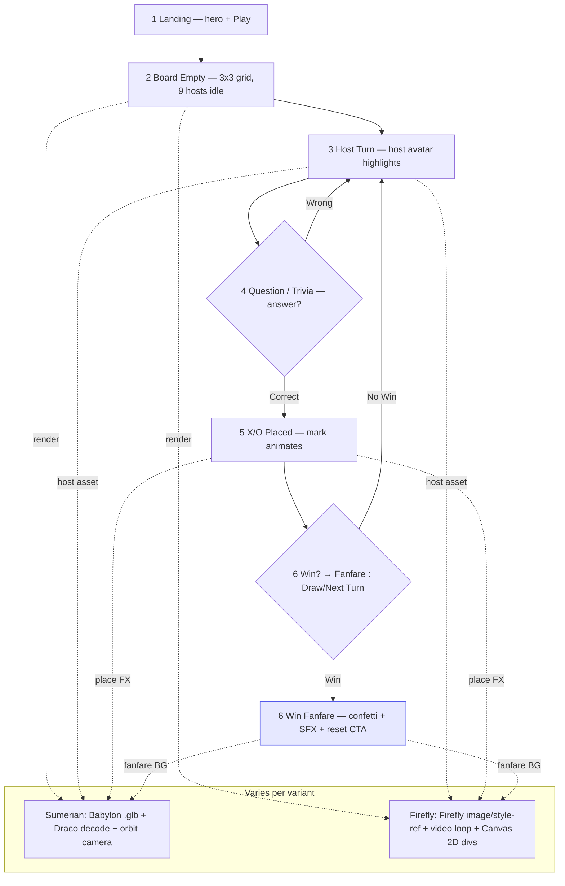

# Universal Storyboard — Sumerian Squares ↔ Firefly Tic-Tac-Toe

> 6-frame universal flow with two render/host variants. Engine, SFX, and question-bank stay **universal**; rendering and host-asset generation **vary**.
> Base: Sumerian 9-host grid (Babylon 3D) vs Firefly image/style-ref + video-loop (Canvas 2D). Lab context: `manifestVersion:2` add-on — iframe (UI) + document sandbox (`express-document-sdk`) via `runtime.exposeApi`.

## Variant legend

| Layer          | Universal (shared)                               | Varies by variant                                                                                                                       |
| -------------- | ------------------------------------------------ | --------------------------------------------------------------------------------------------------------------------------------------- |
| Game engine    | 3×3 state, win/draw detection, turn order, score | —                                                                                                                                       |
| Question bank  | Trivia JSON, difficulty, category rotation       | —                                                                                                                                       |
| SFX / UX       | click, place, win fanfare, invalid-move buzz     | —                                                                                                                                       |
| Host roster    | 9 slots, player vs host mapping                  | **Generation**: Sumerian `.glb` library vs Firefly `generateImage`/`style-ref`                                                          |
| Render         | —                                                | **Sumerian**: Babylon.js + Draco + `.glb` + camera orbit · **Firefly**: Firefly image + video loop + Canvas 2D `div` grid, **no Draco** |
| Asset pipeline | Manifest `panel` + `documentSandbox: code.js`    | Sumerian loads mesh; Firefly draws `editor.createRectangle`/`createEllipse` or iframe DOM                                               |

## Mermaid — universal flow (branch on render/host)

## 6-Frame board

### Frame 1 — Landing

| Aspect    | Sumerian Squares                                                             | Firefly Tic-Tac-Toe                                                                                                         |
| --------- | ---------------------------------------------------------------------------- | --------------------------------------------------------------------------------------------------------------------------- |
| Visual    | Babylon scene placeholder, Sumerian temple HDRI, 9 plinths empty             | Firefly-generated hero board skin (style-ref from `docs/assets/aws-builder-center-banner.svg` palette), video-loop backdrop |
| Host      | 9 Sumerian `.glb` thumbnails (preloaded)                                     | 9 Firefly `generateImage` avatars (style-ref consistent)                                                                    |
| Tech      | `Babylon.Scene`, `DracoCompression`, `ArcRotateCamera` orbit 0.5 rad/s       | iframe `
` grid + CSS video `background: url(firefly-loop.mp4)`, no Draco, Canvas 2D                                    |
| Universal | **Engine idle**, **SFX: intro chime**, CTA `Play` → `editor` not yet touched | Same                                                                                                                        |
| Varies?   | **VARIES — render/host gen**                                                 | **VARIES — render/host gen**                                                                                                |

### Frame 2 — Board Empty (3×3)

| Aspect    | Sumerian Squares                                                                     | Firefly Tic-Tac-Toe                                                                                |
| --------- | ------------------------------------------------------------------------------------ | -------------------------------------------------------------------------------------------------- |
| Visual    | 3×3 raised tiles in Babylon, camera orbit paused top-down                            | 3×3 `div` cells (CSS grid 3×3, `aspect-ratio:1`), Firefly board texture via `createRectangle` fill |
| Host      | Hosts orbit in (animation `SceneLoader.ImportMesh` Draco)                            | Hosts fade-in (Firefly PNG + `video loop` idle)                                                    |
| Tech      | `.glb` ×9, Draco decoder WASM, `scene.registerBeforeRender` orbit                    | `editor.createRectangle` per cell or iframe DOM; **no Draco**, no Babylon                          |
| Universal | **Engine: empty `Array(9).fill(null)`**, **SFX: board hum**, question-bank preloaded | Same                                                                                               |
| Varies?   | **VARIES — Babylon/Draco/orbit**                                                     | **VARIES — Firefly image/video/Canvas 2D**                                                         |

### Frame 3 — Host Turn

| Aspect    | Sumerian Squares                                                           | Firefly Tic-Tac-Toe                                              |
| --------- | -------------------------------------------------------------------------- | ---------------------------------------------------------------- |
| Visual    | Active host tile lifts + emissive glow, camera dolly to host               | Active cell border pulse (`box-shadow`), avatar video loop plays |
| Host      | Sumerian host `.glb` animation clip `Idle→Talk`                            | Firefly avatar + `generateObject` speech bubble (style-ref)      |
| Tech      | `AnimationGroup.play()`, `camera.target = host.position`                   | `div.classList.add('active')`, `Firefly video` `play()`          |
| Universal | **Engine: `currentPlayer = hostId`**, **SFX: host chime**, question queued | Same                                                             |
| Varies?   | **VARIES — mesh anim + camera**                                            | **VARIES — DOM + video**                                         |

### Frame 4 — Question / Trivia

| Aspect    | Sumerian Squares                                                                   | Firefly Tic-Tac-Toe                                                                                   |
| --------- | ---------------------------------------------------------------------------------- | ----------------------------------------------------------------------------------------------------- |
| Visual    | Cuneiform tablet overlay in 3D (plane with dynamic texture)                        | Modal overlay in iframe, Firefly-generated tablet image                                               |
| Host      | Host asks via 3D lip-sync proxy                                                    | Host asks via Firefly TTS thumbnail                                                                   |
| Tech      | `DynamicTexture.drawText(question)` on Babylon plane                               | iframe `fetch(question-bank.json)` → DOM render; sandbox proxy via `runtime.exposeApi` if draw needed |
| Universal | **Question-bank: UNIVERSAL** — same JSON, timer, correct/incorrect logic, SFX tick | Same                                                                                                  |
| Varies?   | **UNIVERSAL logic**, **VARIES skin** (3D plane vs DOM modal)                       |

### Frame 5 — X / O Placed

| Aspect    | Sumerian Squares                                                                  | Firefly Tic-Tac-Toe                                                                                             |
| --------- | --------------------------------------------------------------------------------- | --------------------------------------------------------------------------------------------------------------- |
| Visual    | X = crossed spears mesh, O = clay ring mesh dropped onto tile with physics bounce | X/O = Firefly style-ref glyphs drawn as `div` with scale-in (`transform: scale(0)→1`) or `editor.createEllipse` |
| Host      | Placer host nods, camera shake                                                    | Placer avatar winks, confetti burst (Canvas 2D)                                                                 |
| Tech      | `MeshBuilder` + Draco X/O `.glb`, `Animation` bounce 300ms, camera orbit resume   | Canvas 2D / iframe `div`, **no Draco**, Firefly image for X/O skin                                              |
| Universal | **Engine: `board[i]=mark`, win check `[[0,1,2]...]`**, **SFX: place pop**         | Same                                                                                                            |
| Varies?   | **UNIVERSAL engine**, **VARIES render**                                           |

### Frame 6 — Win Fanfare

| Aspect    | Sumerian Squares                                                    | Firefly Tic-Tac-Toe                                                                   |
| --------- | ------------------------------------------------------------------- | ------------------------------------------------------------------------------------- |
| Visual    | Winning line glows, temple doors open, particles, camera 360° orbit | Winning line CSS `linear-gradient` sweep, Firefly video fanfare loop, `confetti` DOM  |
| Host      | Winning host `.glb` victory animation                               | Winning avatar Firefly hero pose (style-ref)                                          |
| Tech      | `ParticleSystem`, `GlowLayer`, `ArcRotateCamera` 2s orbit           | `video loop` fanfare, `canvas-confetti` in iframe, `editor` draws win line if sandbox |
| Universal | **SFX: fanfare UNIVERSAL**, score increment, `reset()` CTA          | Same                                                                                  |
| Varies?   | **UNIVERSAL SFX/engine**, **VARIES BG/render**                      |

## Cross-variant table (summary)

| Frame         | Universal (stays)                          | Sumerian Squares (Babylon)                                            | Firefly Tic-Tac-Toe (Firefly + Canvas 2D)                               |
| ------------- | ------------------------------------------ | --------------------------------------------------------------------- | ----------------------------------------------------------------------- |
| 1 Landing     | Engine boot, SFX chime, Play CTA           | Babylon scene, HDRI, 9× `.glb` thumbs, Draco, `ArcRotateCamera` orbit | Firefly hero skin, style-ref, video-loop BG, iframe `div`, **no Draco** |
| 2 Board Empty | 3×3 state `null×9`, SFX hum, Q-bank load   | 3×3 tiles mesh, Draco WASM, `registerBeforeRender`                    | CSS grid 3×3, `createRectangle` fills, PNG hosts                        |
| 3 Host Turn   | `currentPlayer`, host chime                | Mesh anim `Idle→Talk`, camera dolly                                   | DOM pulse, video `play()`                                               |
| 4 Question    | **Q-bank UNIVERSAL**, timer, correct→place | DynamicTexture cuneiform plane                                        | DOM modal, Firefly tablet image, `exposeApi` proxy                      |
| 5 X/O Placed  | `board[i]=X/O`, win check, pop SFX         | Spear/ring `.glb`, physics bounce                                     | Glyph `div` scale-in, Firefly X/O asset                                 |
| 6 Win Fanfare | **Fanfare SFX UNIVERSAL**, score, reset    | Glow+particles+360° orbit                                             | Gradient sweep+confetti+video loop                                      |

> **Rule:** Anything that touches `board[9]`, `winLines`, `questionBank`, or `*.mp3` is **UNIVERSAL**. Anything that touches `.glb`/Draco/Babylon/camera vs Firefly `generateImage`/style-ref/video/Canvas-2D `div` is **VARIES**. This lets the same engine ship two skins without forking logic.

## Add-on wiring note

Both variants share `manifestVersion:2` → `entryPoints[{type:"panel", main:"index.html", documentSandbox:"code.js"}]`. Iframe does `import addOnUISdk from "https://express.adobe.com/static/add-on-sdk/sdk.js"; await addOnUISdk.ready` and bridges via `runtime.exposeApi`/`getApi`; sandbox does `import {editor} from "express-document-sdk"` then `editor.createRectangle`/`makeColorFill`/`insertionParent.children.append` only where needed (Firefly board texture). Sumerian keeps document mutations minimal (scene lives in iframe Babylon); Firefly optionally draws win line via sandbox.

## Sources

- Base: Sumerian 9-hosts + Babylon.js `.glb` / Draco / orbit vs Firefly image/style-ref / video-loop / Canvas 2D `div` (task base)
- Add-on model: `docs/ecosystem.md` iframe vs sandbox, `express-document-sdk` `editor`, `runtime.exposeApi`
- Lab: `docs/dispatch-plan.md`, `spec/wiring.md` manifest v2
