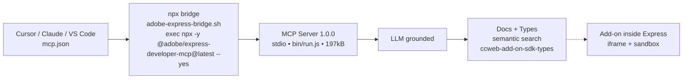

# Adobe Express Developer MCP — Technical Reference

> Concise factual reference for `@adobe/express-developer-mcp`. Verified via `npm view --json` and Adobe developer docs.




## Package identity

| Field               | Value                                              |
| ------------------- | -------------------------------------------------- |
| **Package**         | `@adobe/express-developer-mcp`                     |
| **Latest dist-tag** | `1.0.0`                                            |
| **Current version** | `1.0.0`                                            |
| **Description**     | MCP server for Adobe Express Developer             |
| **License**         | See LICENSE file                                   |
| **Author**          | Adobe Inc.                                         |
| **Type**            | `module` (ESM)                                     |
| **Engines**         | `node >=18.0.0`                                    |
| **Bin**             | `adobe-express-developer-mcp-server -> bin/run.js` |

Source: `npm view @adobe/express-developer-mcp --json` — `name`, `dist-tags.latest`, `version`, `type`, `engines.node`, `bin`, `description`.

## Version matrix

| Version | Published (time)                                  | Dist-tag |
| ------- | ------------------------------------------------- | -------- |
| `1.0.0` | `2026-01-14T17:44:57.924Z` (also `time["1.0.0"]`) | `latest` |

Registry timestamps:

- `time.created`: `2026-01-14T17:44:57.624Z`
- `time.modified`: `2026-07-08T08:12:01.697Z`

Only one version published to date (`versions: ["1.0.0"]`).

Source: `npm view @adobe/express-developer-mcp --json` (`time`, `versions`, `dist-tags`).

## Distribution

| Field                  | Value                                                                                       |
| ---------------------- | ------------------------------------------------------------------------------------------- |
| **Registry**           | `https://registry.npmjs.org/` (`publishConfig.registry`)                                    |
| **Tarball**            | `https://registry.npmjs.org/@adobe/express-developer-mcp/-/express-developer-mcp-1.0.0.tgz` |
| **Tarball file**       | `express-developer-mcp-1.0.0.tgz`                                                           |
| **Integrity (sha512)** | `kqEGiGSb3QjfsWAaSwHk0pRwcTg6LGEj6A02baOxQR81ipTOEgFETE+0aeyyVacUfIMJyceQVslESjgdbv/puQ==`  |
| **Shasum (sha1)**      | `83d21b4a13d45dff4fbc00134f3fbd205936d2e9`                                                  |
| **File count**         | `14`                                                                                        |
| **Unpacked size**      | `197185` bytes (~197 kB)                                                                    |

Source: `npm view @adobe/express-developer-mcp --json` (`dist.tarball`, `dist.integrity`, `dist.shasum`, `dist.fileCount`, `dist.unpackedSize`). Verified with `npm pack --dry-run` equivalent fields.

## Runtime & transport

- **Module type**: `module` — run with Node ESM.
- **Entry / bin**: `adobe-express-developer-mcp-server` maps to `bin/run.js` (see `bin` field). Built via `esbuild` to `dist`, inspected via `npm run inspect` → `npx @modelcontextprotocol/inspector node bin/run.js`.
- **Transport**: `stdio`. Launched via `npx` — no separate server process to manage.
- **Launch command** (no auth required):

```bash
npx -y @adobe/express-developer-mcp@latest --yes
# equivalent args array for MCP config: ["@adobe/express-developer-mcp@latest", "--yes"]
```

- **Requirements**: `node >=18` (`node --version`), MCP-compatible IDE with LLM integration.

Sources: `npm view --json` (`type`, `bin`, `engines`, `scripts.inspect`) and `https://developer.adobe.com/express/add-ons/docs/guides/getting-started/local-development/mcp-server` (Prerequisites, TL;DR Quick Setup, stdio via npx).

## Predecessor

- **Beta package**: `@adobe/express-add-on-dev-mcp` — **deprecated**.
- **Superseded by**: `@adobe/express-developer-mcp` (stable, officially supported, production ready). Docs note: “The Adobe Express Add-on MCP Server (Beta) has been replaced by the Adobe Express Developer MCP Server … supersedes the beta version (`@adobe/express-add-on-dev-mcp`) now deprecated, in all MCP configurations.”

Source: Adobe docs `mcp-server` page “New Stable MCP Server” callout.

## Capabilities

| Capability                                         | What it provides                                                                              |
| -------------------------------------------------- | --------------------------------------------------------------------------------------------- |
| **Semantic documentation search**                  | Find relevant guides, examples, tutorials without leaving editor                              |
| **TypeScript definitions**                         | Official `@adobe/ccweb-add-on-sdk-types` types — accurate completions, reduced hallucinations |
| **Structured access for grounded code generation** | LLM gets grounded, up-to-date Adobe Express Add-on docs to generate code/debug/build          |

Source: Adobe docs `mcp-server` page “What it does” + `npm view` dependencies (`@adobe/ccweb-add-on-sdk-types`, `@modelcontextprotocol/sdk@1.12.0`).

## Setup (no clone/install/build)

1. **Add JSON to MCP config** under `mcpServers` (see snippets below).
2. **Restart IDE** to load the MCP server.
3. **Verify**: no auth required; server starts via `npx` on demand. Check MCP panel / output shows `adobe-express-developer` connected; test with a documentation query in the LLM chat.

Source: Adobe docs “Quick Setup (No Installation Required)” Steps 1–2, plus “Requirements: Node.js 18+ … No auth required” note on page.

## Configuration snippets

### Cursor — `~/.cursor/mcp.json`

```json
{
  "mcpServers": {
    "adobe-express-developer": {
      "command": "npx",
      "args": ["@adobe/express-developer-mcp@latest", "--yes"]
    }
  }
}
```

### Claude Desktop — `claude_desktop_config.json`

_(macOS: `~/Library/Application Support/Claude/claude_desktop_config.json`, Windows: `%APPDATA%\Claude\claude_desktop_config.json`)_

```json
{
  "mcpServers": {
    "adobe-express-developer": {
      "command": "npx",
      "args": ["@adobe/express-developer-mcp@latest", "--yes"]
    }
  }
}
```

### VS Code — `~/.vscode/mcp.json` (or workspace `.vscode/mcp.json`)

```json
{
  "servers": {
    "adobe-express-developer": {
      "command": "npx",
      "args": ["@adobe/express-developer-mcp@latest", "--yes"]
    }
  }
}
```

> Note: Cursor/Claude use `mcpServers`; VS Code docs show `servers` at time of writing — keep key as your VS Code version expects. Restart IDE after saving.

Sources: Adobe docs `mcp-server` page “Configuration file locations” + per-IDE tabs (Cursor `~/.cursor/mcp.json`, Claude `claude_desktop_config.json`, VS Code `~/.vscode/mcp.json`).

## Feedback

- **Adobe Express Add-on Developers Discord**: https://discord.com/invite/nc3QDyFeb4 — real-time chat with team/community, feedback on accuracy/coverage requested on docs page.

Source: Adobe docs `mcp-server` page “Feedback requested” callout.

## Sources

1. `npm view @adobe/express-developer-mcp --json` — executed 2026-08-31; verifies `version: 1.0.0`, `dist-tags.latest: 1.0.0`, `time.created: 2026-01-14T17:44:57.624Z`, `time.modified: 2026-07-08T08:12:01.697Z`, `dist.tarball: express-developer-mcp-1.0.0.tgz`, `dist.integrity: sha512-kqEGi…`, `dist.fileCount: 14`, `dist.unpackedSize: 197185`, `bin: adobe-express-developer-mcp-server -> bin/run.js`, `type: module`, `engines.node: >=18.0.0`.
2. `https://developer.adobe.com/express/add-ons/docs/guides/getting-started/local-development/mcp-server` — fetched 2026-08-31; verifies transport `stdio` via `npx -y @adobe/express-developer-mcp@latest --yes`, config locations (`~/.cursor/mcp.json`, `claude_desktop_config.json`, `~/.vscode/mcp.json`), predecessor `@adobe/express-add-on-dev-mcp` deprecated beta superseded, capabilities (semantic search, TypeScript definitions, structured access), setup steps (add json to mcpServers → restart IDE → no auth), Discord `https://discord.com/invite/nc3QDyFeb4`.
3. `npm view readme` / `npm pack --dry-run` — readme and tarball contents derived from registry entry (14 files, 197 kB unpacked, ESM via `bin/run.js`).
